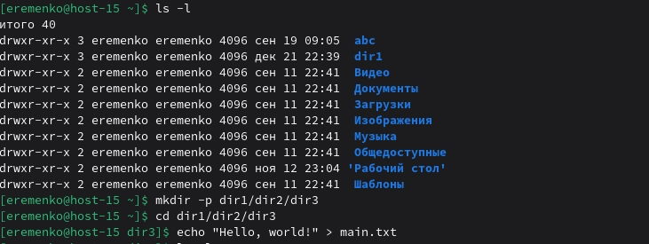
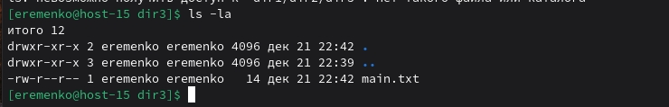
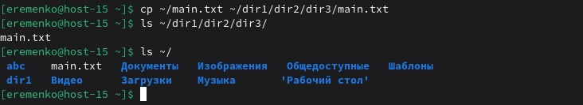

# Task 1
# Работа в консольке
1.	Переместиться между директориями:
cd /name/name1 - перемещение по полному пути
cd name_dir - переместиться в папку в текущей директории
cd .. - переместиться на уровень выше
cd ~ - переместиться в домашнюю директорию
cd - вернуться в пердыдущую директорию

2.	Вывести список файлов в директории: 
ls 
ls -l - детальный список с правами, датами

4.	Вывести список всех файлов в директории:
ls -a - показать все файлы, вкдючая скрытые

5.	Создать папку с подпапками:
mkdir -p dir1/dir2/dir3

6.	Внутри папки создать файлик и записать в него что-нибудь:
cd dir1/dir2/dir3
echo "Hello, world" > main.txt

7.	Переместить файл из одной директории в другую: 
mv main.txt /home/eremenko/

8.	скопировать файл из одной директории в другую (из домашней папки /home/eremenko/):
cp main.txt /home/eremenko/dir1/dir2/dir3/main.txt

10.	переименовать файл:
mv dir1/dir2/dir3/main.txt dir1/dir2/dir3/renamed.txt

11.	сравнить содержимое файла:
diff dir1/dir2/dir3/renamed.txt main.txt

12.	отсортировать содержимое файла по возрастанию и убыванию:
sort dir1/dir2/dir3/renamed.txt - по возрастанию
sort -r dir1/dir2/dir3/remaned.txt - по убыванию

13.	удалить все папки и файлы:
– rm -rf dir1

# Task 2
# Перенаправляем
1.	Как работают команды >,>>?
- > — создает файл или перезаписывает существующий
Например: echo "First line" > main.txt - файл main.txt содержит строку "First line"

- >> — создает файл или добавляет в конец существующего
Например: echo "Second line" >> main.txt - файл содержит две строки

2.	Что такое перенаправление ввода? stderr,stdout;
- stdout - стандартный поток вывода, по умолчанию терминал
- stderr - стардартный потом ошибок, по умолчсанию терминал

3.	Вывести содержание файла не используя текстовые редакторы;
cat main.txt

4.	Создать файл с содержимым не используя текстовые редактор;
echo "Third line" > main.txt

5.	перенаправить stdout в stderr и обратно на примере команды kinit, ping, tracert
kinit user 2> errors.txt # Перенаправляем stderr в файл
ping example.com > output.txt 2>&1 # Перенаправляем stdout и stderr в один файл (output.txt)

6.	чем отличаются stdout и stderr
- stdout используется для обычного вывода программы (результаты выполнения)
- stderr используется для вывода сообщений об ошибках и предупреждениях

7.	что такое stdin?
stdin - стандартный поток ввода, по умолчанию клавиатура

8.	как отправить весь вывод команды в пустоту?
команда > /dev/null 

9.	можно ли отправить одновременно stdin и stdout в пустоту?

Да, можно. Для этого нужно перенаправить поток вывода в файл /dev/null

