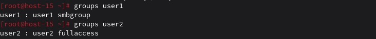
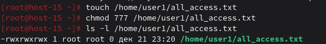
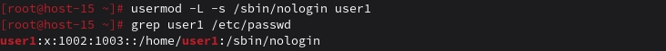

# Task 1
# Управление пользователями 
1.	Добавьте пользователей user1 и user2: 
1.1) user1 - оболочка bash:
su -
useradd -m -s /bin/bash user1 (-m - создание домашней директории для пользователя, -s /bin/bash: для user1 будет использована оболочка bash)

1.2) user2 - оболочка sh:
useradd -m -s /bin/sh user2

1.3) установите им пароли:
(1.1)passwd user1; 
(1.2)passwd user2 

2.	Назначьте пользователю 1 группу администраторов, пользователя 2 добавьте в группу пользователя 1
2.1)usermod -aG user1 (добавляем пользователя 1 в группу администраторов)

2.2)usermod -aG user1 user2 (добавляем пользователя 2 в группу пользователя 1)
 

3.	Что такое права доступа? Выведите права доступа на файлы в директории пользователя
Чтение (r) – возможность просматривать содержимое файла или список файлов в директории
Запись (w) – возможность изменять файл или добавлять файлы в директорию
Исполнение (x) – возможность исполнять файл или заходить в директорию
ls -l – для вывода прав доступа на файлы в текущей директории

4.	Как изменить права на файлы? Создайте файл который будет на который у всех пользователей будут все возможные права
touch /home/user1/main.txt
chmod 777 /home/user1/main.txt

6.	Как называется учётная запись встроенного администратора в linux?
root - суперпользователь с полными правами в системе

7.	Как выполнить команду от имени администратора?
sudo 

8.	Есть ли ограничения у суперпользователя? 
Суперпользователь root обладает максимальными правами и доступом к системе. Но у root существуют ограничения на уровне системы, например, запреты на операции, которые могут привести к поломке системы.

9.	Удалите пользователя 2 с помощью пользователя 1:
su -
userdel -r user2

10.	Как можно изменить владельца папки? измените владельца папки из пункта 4. – 
(пока user2 еще есть)
chown user2:user2 /home/user1/main.txt

Task 2
Запрещаем
1. Запретите пользователю user1 из предыдщуего задания выполнять вход в систему
usermod -L -s /sbin/nologin user1 - блокируем пароль и меняем оболочку на noLogin

3. Как вы это сделали?
Можно сделать поэтапно: 
usermod -L user1  - блокировка пароля
usermod -s /sbin/nologin user1 - меняем оболочку на noLogin

4. Какие ещё способы это сделать вы знаете?
chage -E 0 user1 - истечение срока пароля

5. Можно ли создать пользователей с одинаковыми username?
Нет, так как username должен быть уникальным

