# Task 1
# Настриваем
1. Какой по умолчанию используется порт для поключения?
su -
grep Port /etc/openssh/sshd_config
#По умолчанию: 22
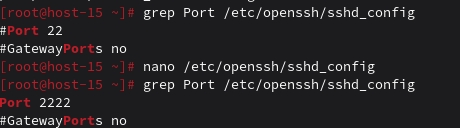

3. Можно ли его изменить? если да то как?
#Редактируем конфиг
nano /etc/openssh/sshd_config
#Находим строку #Port 22 и меняем на:
Port 2222
#Сохраняем и перезапускаем службу
systemctl restart sshd

4. Какая служба отвечает за обработку запросов на подключения по ssh?
systemctl status sshd
#Имя службы: sshd (Secure Shell Daemon)
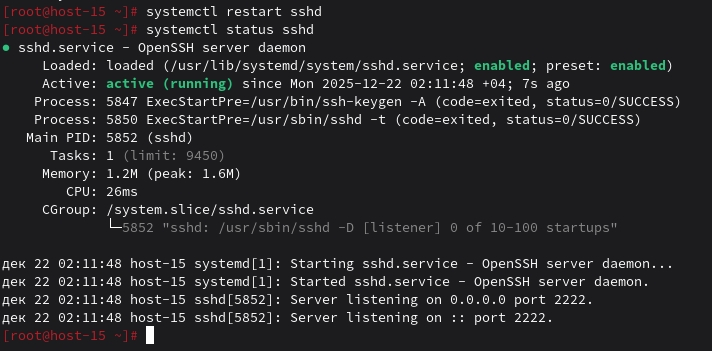

5. Какой файл конфигурации отвечает за его настройку?
/etc/openssh/sshd_config

6. Попробуйте подключиться по ssh к предоставленному вам серверу
ssh student@ternar.io -p 215

7. Отредактируйте файл настроек на сервере так, чтобы была возможность подключиться к серверу используя пользователя root
sudo sed -i 's/#PermitRootLogin.*/PermitRootLogin yes/' /etc/openssh/sshd_config
sudo systemctl restart sshd
sudo grep PermitRootLogin /etc/openssh/sshd_config
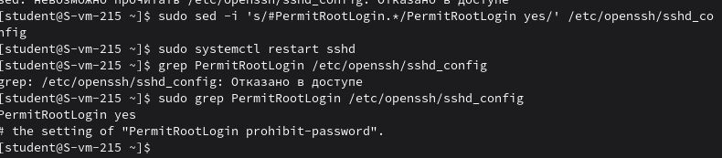

8. Измените колличество ошибок ввода пароля перед сборосом соединения, покажите эти измененения
sudo sed -i 's/#MaxAuthTries.*/MaxAuthTries 3/' /etc/openssh/sshd_config
sudo grep MaxAuthTries /etc/openssh/sshd_config
sudo systemctl restart sshd
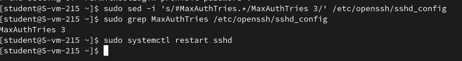

9. Создайте пользователя ssh-user и попробуйте им подключиться к серверу
sudo useradd -m ssh-user
sudo passwd ssh-user

10. Ограничте ему возможность подключения к серверу
echo "DenyUsers ssh-user" | sudo tee -a /etc/openssh/sshd_config
sudo grep DenyUsers /etc/openssh/sshd_config
sudo systemctl restart sshd
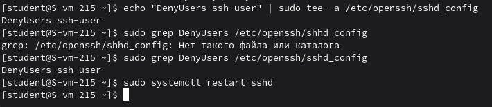

11. Как вы это сделали?
Описано выше

12. Что хранится в файле known_hosts?
#Просмотр содержимого
cat ~/.ssh/known_hosts
#В файле known_hosts хранятся отпечатки SSH-ключей серверов для проверки их подлинности.
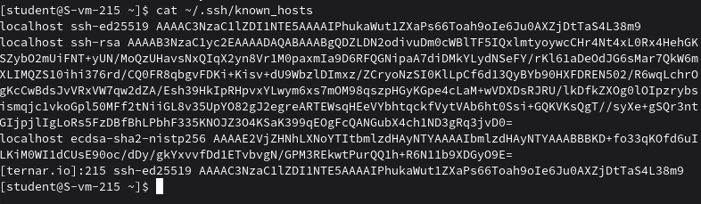

# Task 2
# Конфижим для удобства
1. Где хранятся пользвательские и системные настройки подключения?
#Системные настройки (для всех пользователей)
ls -la /etc/openssh/ssh_config

#Пользовательские настройки
ls -la ~/.ssh/config

2. Что за файл options?
Основной файл конфигурации SSH-клиента для пользовательских настроек подключения.

3. Отредактируйте файл options так, чтобы можно было подключаться не вводя имя пользвателя и порт
mkdir -p ~/.ssh
cat > ~/.ssh/config << 'EOF'
Host my-server
    HostName ternar.io
    User student
    Port 215
EOF

#Проверка
cat ~/.ssh/config

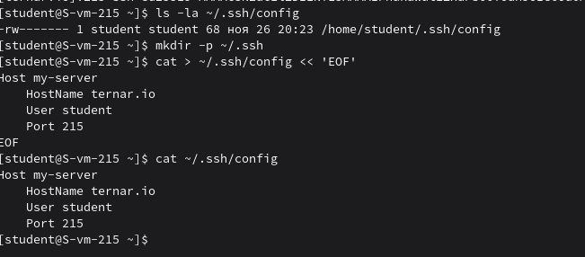    
4. Назовите подключение удобным для вас спсобом
my-server

5. Проверьте работоспособность
ssh my-server
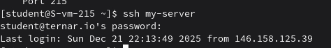

# Task 3
# Ключики
1. Что такое ssh ключи и зачем они нужны?
SSH ключи - это пара криптографических ключей (приватный и публичный)
Назначение: безопасная аутентификация без ввода пароля
Приватный ключ хранится у клиента, публичный - на сервере

2. Как их создать?
ssh-keygen -t ed25519 -f ~/.ssh/id_ed25519 -N ""

#Проверка
ls -la ~/.ssh/id_ed25519*
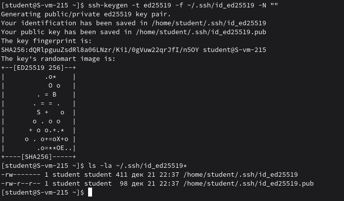

4. Создайт пару публичный/приватный ключ ed_25519, где они хранятся?
~/.ssh/id_ed25519 - приватный ключ
~/.ssh/id_ed25519.pub - публичный ключ

5. Скопируйте публичный ключ на ваш сервер, в каком файле он будет храниться?
ssh-copy-id -i ~/.ssh/id_ed25519 my-server
#Публичный ключ хранится в файле ~/.ssh/authorized_keys
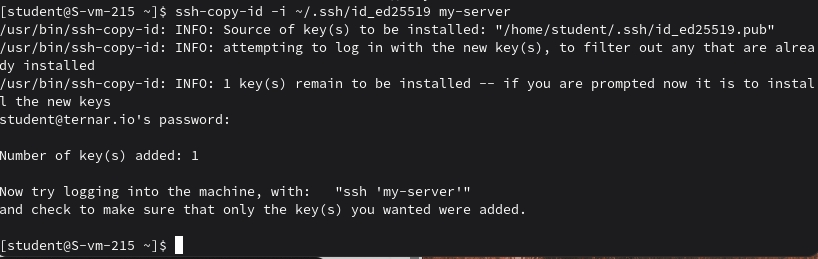

6. Попробуйте подключиться к серверу, у вас запросили пароль?
ssh -i ~/.ssh/id_ed25519 my-server
#Пароль не запросился

7. Запретите подключение с паролем для всех пользователей, оставьте только с помощью ключа.
sudo sed -i 's/#PasswordAuthentication yes/PasswordAuthentication no/' /etc/openssh/sshd_config
sudo sed -i 's/PasswordAuthentication yes/PasswordAuthentication no/' /etc/openssh/sshd_config
sudo systemctl restart sshd

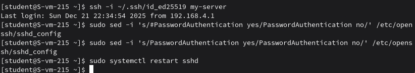
#Проверка

sudo grep PasswordAuthentication /etc/openssh/sshd_config
