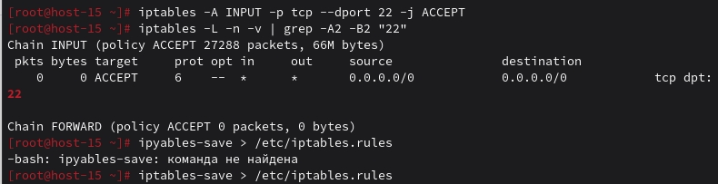
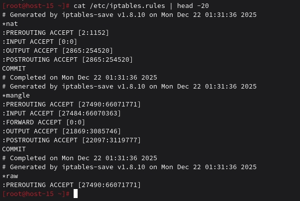
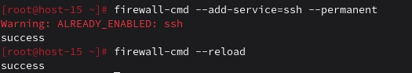
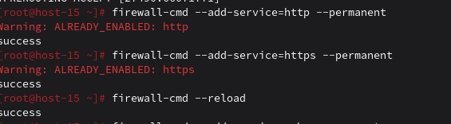
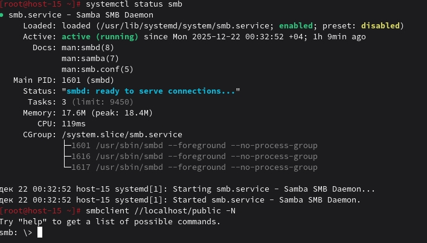
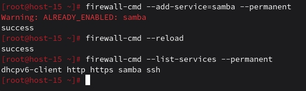

#  Task 1
# Открываем iptables
#При работе с firewall не рекомендую отключаться от текущей сессии ssh. Лучше подключаться из другой консольки.

1. Установите iptables
su -
apt-get update
apt-get install iptables

2. Проверьте осталась ли возможность подключения по ssh к вашему серверу
ssh student@ternar.io -p 215
#Подключение не установилось

3. Почему может пропасть такая возможность?
Возможность подключения по SSH пропадает после установки iptables потому что он блокирует все входящие подключения по умолчанию. Iptables устанавливает политику DROP для цепочки INPUT, что означает запрет всех входящих соединений. SSH работает на порту 22/TCP и требует входящих подключений от клиентов к серверу. Без явного разрешающего правила для порта 22, все SSH-подключения будут блокироваться на сетевом уровне. Для восстановления доступа необходимо добавить правило, разрешающее входящий трафик на порт 22 TCP.

4. Откройте нужный порт на сервере чтобы восстановить подключение
iptables -A INPUT -p tcp --dport 22 -j ACCEPT

6. Это будет udp или tcp прот?
SSH использует TCP протокол, поэтому нужно открывать TCP порт. SSH работает поверх надежного соединения TCP, а не UDP, так как требует гарантированной доставки данных и установления сессии. Команда для открытия порта должна указывать протокол TCP: -p tcp --dport 22.

Сохраняем
6. Cохраняются ли записанные вами правила после перезагрузки?
Нет, правила iptables сбрасываются при перезагрузке

7. Как их сохранить?
iptables-save > /etc/sysconfig/iptables.rules

Task 2
Открываем firewald
1. Удалите iptables и установите firewalld
su -
apt-get remove iptables 
apt-get install firewalld
systemctl enable firewalld
systemctl start firewalld

2. Попробуйте так-же проверить возможность подключения по ssh
ssh student@ternar.io -p 215

3. Если её нет то откройте порт
sudo firewall-cmd --add-service=ssh --permanent
sudo firewall-cmd --reload

4. Выведите список открытых портов с помощью firewall-cmd
firewall-cmd --list-ports
firewall-cmd --list-all

5. Можно ли там добавить порты по названию сервиса?
Да:
firewall-cmd --add-service=http --permanent
firewall-cmd --add-service=https --permanent
firewall-cmd --reload

7. На вашей Локальной виртуальной машине попробуйте подключиться к серверу samba из предыдущих заданий
sudo systemctl status smb
smbclient //localhost/public -N

9. Если не получилось то откройте нужные порты
firewall-cmd --add-service=samba --permanent
firewall-cmd --reload

11. Сделайте так чтобы изменения были постоянными
#Флаг --permanent делает правила постоянными
firewall-cmd --add-service=samba --permanent
firewall-cmd --reload

#Проверить что правила добавились

firewall-cmd --list-services --permanent

